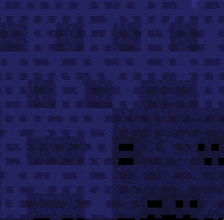
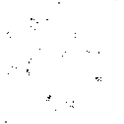
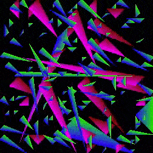

# Strata

Experiments and visualizations of hierarchical cellular automata to simulate tiered or tree-based dynamical systems

## Installation

Python3+ is recommended.

```bash
pip install pyglet numpy
```

## Usage

```bash
git clone {repo_url}
cd strata
python . \
    --width {pixels_wide} \
    --height {pixels_height} \
    --depth {maximum_recursion_depth}
```

## Examples

### QuadTrees



### QuadNoise



### Vertex Triangulation


