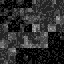
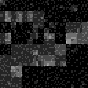
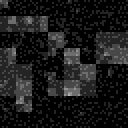
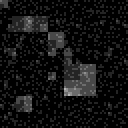
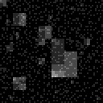
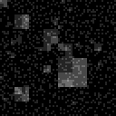
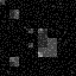
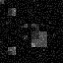
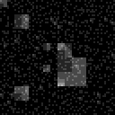
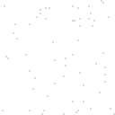

# Strata

QuadTree-based cellular automata rendering in Python.

## Installation

Python3+ is recommended.

```bash
pip install pyglet numpy
```

## Usage

```
usage: strata [-h] [--width WIDTH] [--height HEIGHT] [--depth DEPTH]
              [--slice SLICE] [--out OUT] [--steps STEPS]

Renderer for hierarchical cellular automata

optional arguments:
  -h, --help       show this help message and exit
  --width WIDTH    Width of window
  --height HEIGHT  Height of window
  --depth DEPTH    Maximum recursion depth of tree
  --slice SLICE    Show only a 1-layer slice
  --out OUT        Output directory for screenshots
  --steps STEPS    Number of steps before terminating (-1 == infinity)}
```

```bash
# 128x128 matrix, levels 0-7 only, 10 iterations
python3 . \
--width 128 \
--height 128 \
--depth 7 \
--out screenshots \
--steps 10
```

## Examples

Two rulesets have been implemented:

1. Conway
2. Gamma

### Conway

An update rule based on conway's game of life using the neighbor nodes + children + parent values to determine updates.

Note: the "leaf" level (i.e. 1x1 pixel grid) is "immutable" and remains constant from t=0 onward.

#### Sparse Initial Matrix

`PROBABILITY_OF_LEAF_ALIVE_ON_START=0.02`

| `t` | screenshot                           | notes                                      |
| --- | ------------------------------------ | ------------------------------------------ |
| 0   |   | Initialization, hardly any pixels          |
| 1   |   |                                            |
| 2   |   |                                            |
| 3   |   |                                            |
| 4   |   |                                            |
| 5   |   |                                            |
| 6   |   |                                            |
| 7   |   |                                            |
| 8   |   |                                            |
| 9   |   |                                            |
| 10  |  | Mostly stable structures, cyclical updates |

### Gamma

A custom rule based on the unique properties of the quad tree.

#### Sparse Initial Matrix

`PROBABILITY_OF_LEAF_ALIVE_ON_START=0.000001`

| `t` | screenshot                              | notes                             |
| --- | --------------------------------------- | --------------------------------- |
| 0   |   | Initialization, hardly any pixels |
| 1   |   |                                   |
| 2   |   |                                   |
| 3   |   |                                   |
| 4   |   | Grid emerges                      |
| 5   |   | Grid of grids emerges             |
| 6   |   |                                   |
| 7   |   |                                   |
| 8   |   |                                   |
| 9   |   | Grids oscillate                   |
| 10  |  |                                   |

#### Dense Initial Matrix

`PROBABILITY_OF_LEAF_ALIVE_ON_START=0.05`

| `t` | screenshot                          | notes                             |
| --- | ----------------------------------- | --------------------------------- |
| 0   |   | Initialization, hardly any pixels |
| 1   |   |                                   |
| 2   |   |                                   |
| 3   |   |                                   |
| 4   |   | Grid emerges                      |
| 5   |   | Noisier grid of grids emerges     |
| 6   |   |                                   |
| 7   |   |                                   |
| 8   |   |                                   |
| 9   |   |                                   |
| 10  |  | Less defined grids?               |

### Other Neat-Looking Artifacts

Here are a couple of neat looking artifacts that came out of the process:

### QuadTrees


### QuadNoise


### Vertex Triangulation


### Timeseries
